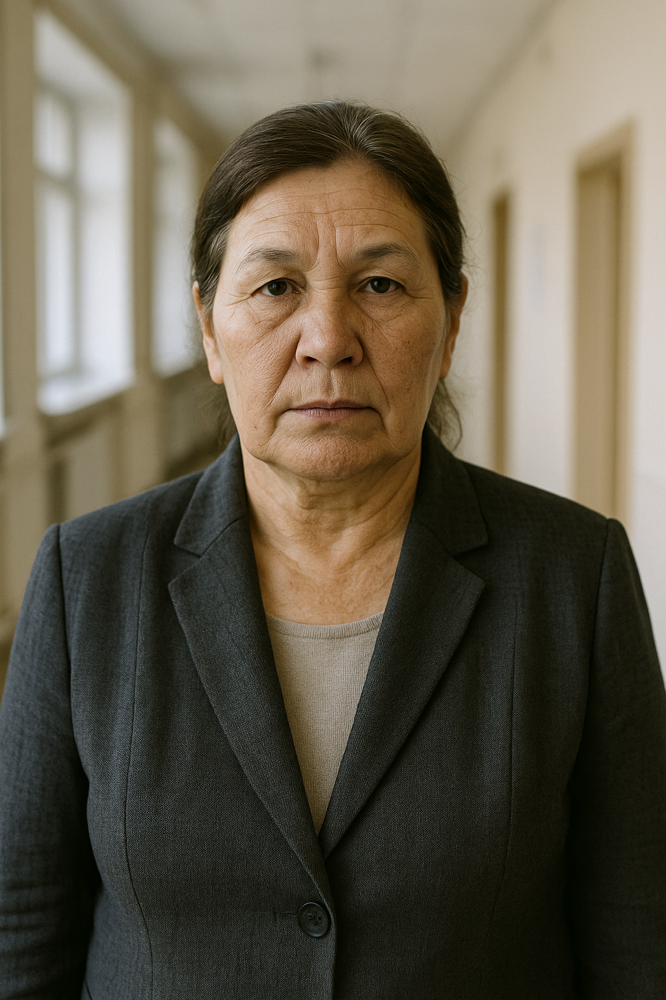

# synthforge — как работает программа и как она проверялась

Документ для руководства: что делает программа, что происходит внутри на
одном живом примере, как проверялась и что показала проверка. Цифры и примеры
взяты из реальных прогонов, ничего не нарисовано вручную.

Состояние проекта, бюджет и открытые вопросы — в [ОТЧЁТ.md](ОТЧЁТ.md).

---

## 1. Что это одним абзацем

Программа массово создаёт связный контент по заданным правилам. Ей говорят
«нужно 500 врачей» или «собери 3 центра», и она создаёт их так, чтобы каждый
был отличим от остальных, внутренне непротиворечив и согласован с соседями:
врач в центре для наркозависимых действительно работал с наркозависимыми,
«23 места» в тексте о центре совпадают с описанием дома, а у одного человека не
бывает двух рабочих мест.

Главная идея: **всё, что можно решить кодом, решает код. Модель только
излагает готовые факты человеческим языком.** Она не выбирает, каким будет
человек, — к моменту обращения к ней это уже решено.

---

## 2. Как работает — на примере одного врача

Разберём путь одного врача от постановки до страницы центра. Всё ниже — реальный
вывод программы.

### Шаг 1. Постановка

```
forge run doctor 16
```

Можно добавить пожелание словами (`--brief "врачи с опытом от семи лет"`),
доли («20% — с опытом от 20 лет»), бюджетный потолок и режим уникальности.

### Шаг 2. План: каким будет человек — решает код

Программа берёт **словарь параметров врача** — 42 характеристики с допустимыми
значениями и правилами — и составляет план. Модель ещё не вызывалась.

Вот одна строка плана, как есть:

```
[базовые]      Пол: мужской · Возраст: 43 · Родной регион: Центральная Россия
[образование]  специалитет и ординатура · медицинский университет в Поволжье
[опыт]         психиатр-нарколог · стаж 15 лет · госклиника: да
               опыт в психиатрии: да · детоксикация: да
[практика]     двойной диагноз, наркозависимые
               подход: сочетание фармакологии и психотерапии
```

Почему кодом, а не моделью. Если попросить модель «придумай 500 разных
врачей», она придумает несколько типажей и выдаст вариации каждого: одинаковые
имена, одинаковые биографии. Код раскладывает популяцию по заданным долям
точно и проверяет каждую строку правилами:

```
стаж ≤ возраст − 24                     медицинское образование — не меньше 6 лет
психиатр → есть опыт в психиатрии       иначе это надпись, а не специальность
двойной диагноз → есть психиатрия
докторская степень → не моложе 45
многодетность → выше шанс подростковой практики    (мягкое правило, сдвиг вероятности)
```

Строка, нарушающая правило, пересобирается. До модели она не доходит.

### Шаг 3. Имя — из справочника, а не от модели

Модель, придумывающая имена, на тысяче человек даёт полторы сотни разных имён,
все из самых частых, и без связи с возрастом. Справочник содержит 85 000
сочетаний и учитывает моду по годам рождения: у рождённых в 1955 году чаще
Владимир и Юрий, у рождённых в 1995 — Артём и Никита. Отчество берётся от
имени отца, выбранного из моды на поколение раньше.

### Шаг 4. Внешность — отдельным набором параметров

Для портрета у того же человека свой набор:

```
Телосложение: худощавое · Лицо: вытянутое · Волосы: с проседью, залысины
Асимметрия: едва заметная · Мешки под глазами: заметные
Кожа: неровная, расширенные поры · Выражение: спокойное, без улыбки
Обстановка: кабинет, стол в расфокусе · Съёмка: любительская, естественный свет
```

Половина этих параметров нужна для одного: чтобы портрет не вышел
«вылизанным», как в фотобанке. В словаре намеренно нет вариантов «идеальная
симметрия», «идеальная укладка», «широкая улыбка». Биография в промпт портрета
не попадает, и наоборот.

### Шаг 5. Модель пишет текст

Модель получает три блока:

- **что известно** — можно называть прямо;
- **как писать** — указания, которые в текст не переносятся (характер,
  происхождение, счётчики). Без этого разделения первые тексты выходили
  анкетой: «прошёл шесть повышений квалификации, работал в двух местах»;
- **обязательно упомянуть** — например, имя.

Ответ — структурированный: биография, профессиональный путь, цитата, и
отдельно числа, которые модель использовала. Их сверка с планом — самая точная
проверка того, что модель не «переписала» факты.

### Шаг 6. Приёмка: код проверяет, что написала модель

Ответ проходит проверки. Что-то исправляется автоматически, что-то
отбраковывается и пишется заново.

| Проверка | Что ловит | Что делается |
|---|---|---|
| числа совпадают с планом | модель написала «25 лет стажа» при заданных 18 | отбраковка |
| числа в тексте объяснимы | «более двадцати лет в профессии» при стаже 18 — ловится и цифрами, и словами | отбраковка |
| рекламные штампы | «ведущий специалист», «уникальная методика» | отбраковка |
| анкетные обороты | «возрастной фокус — подростки», «мест работы» | отбраковка |
| латиница в русском тексте | «стабильность и predictability» | отбраковка |
| абзацы пересказывают друг друга | второй абзац повторяет первый | отбраковка |
| длина | слишком коротко для карточки | отбраковка |
| похожесть на уже созданных | почти копия другой биографии | отбраковка |
| полное ФИО в каждом абзаце | «Иванов Пётр Сергеевич… Иванов Пётр Сергеевич…» | **исправляется кодом** |

Принцип, выработанный на живых прогонах: **отбраковывать только то, что
нельзя исправить механически.** Каждая отбраковка — это оплаченный заново
вызов модели.

Результат — реальная карточка из прогона:



**Родионова Анастасия Михайловна**
61 год · психиатр-нарколог · стаж 17 лет

> Родионова Анастасия Михайловна окончила медицинский университет на юге
> России, где получила специалитет и прошла ординатуру. После этого она
> вернулась в родной регион на Дальнем Востоке и начала работать
> психиатром-наркологом. За 17 лет практики она сосредоточилась на помощи
> взрослым пациентам с зависимостями, сочетая клиническую работу с
> консультированием их родственников.

> *В работе с аддиктивными расстройствами я ставлю акцент на повышение
> мотивации и последовательное преодоление отрицания у пациента.*

<br clear="left">

### Шаг 7. Запись: переживает сбои

Прогон на тысячи сущностей идёт сутками, и за это время обязательно что-то
отвалится: сервер, канал, деньги на счёте. Поэтому каждая сущность — отдельное
задание в очереди со своим статусом. Если процесс упал, при перезапуске
незавершённые задания возвращаются в очередь, и прогон продолжается с того же
места.

Запись в хранилище идёт пачками с меткой. Если на отправке оборвался канал,
программа не повторяет её вслепую — повтор создал бы дубли, — а сначала
проверяет по метке, что реально легло: всё, ничего или часть.

### Шаг 8. Сборка центра: из готового, по правилам

```
forge compose 3
```

Центр ничего не сочиняет. Из уже созданных пулов берутся здание, программа,
руководитель и команда. Модель пишет только текст о центре, и в тексте
упоминаются реальные люди из базы.

Правила состава:

- один человек, здание и программа — только в одном центре, на всю базу;
- программа того же ценового уровня, что и здание;
- в центре для зависимых обязательно есть нарколог;
- двойной диагноз — только при психиатрическом опыте в команде;
- руководитель не заметно моложе своей команды;
- в одной команде нет однофамильцев;
- чем больше мест, тем больше персонала;
- команда подбирается под специализацию: в подростковый центр — люди с опытом
  работы с подростками.

Название центра берётся из справочника («Попутный ветер», «Береста», «Рубеж»).
Модель называла центры «Реабилитационный уральский центр двенадцатишагов», и
такие названия каждый раз уходили в брак.

### Шаг 9. Страница для приёмки

```
forge site
```

Центр целиком на одной странице: текст о центре, дом с фото, программа,
руководитель, команда с портретами. Это внутренний инструмент приёмки, страницы
закрыты от индексации.


---

## 3. Как проверялось

Проверка шла на четырёх уровнях. Все тесты, кроме живых прогонов, не требуют
ни сети, ни ключей и запускаются одной командой:

```
cargo test --workspace
→ 123 теста, 0 провалов
```

### Уровень 1. Механизм по отдельности

Каждая часть проверена отдельно, на искусственных данных.

- **Разбор правил** из текста в словарях: арифметика, сравнения, логика,
  проверка списков. Правило, записанное текстом, после разбора и обратной
  сборки означает то же самое.
- **План популяции**: доли соблюдаются точно («20% от 300» — ровно 60, а не
  «около того»), одинаковый сид даёт одинаковую популяцию, жёсткие правила не
  нарушаются ни на одной строке из сотен.
- **Проверка словаря при загрузке**: опечатки в значениях, ссылки на
  несуществующие параметры, неправильный порядок объявления — всё, что иначе
  тихо испортило бы контент, ловится до первого запуска.
- **Справочник имён**: женские фамилии и отчества в женской форме, мода на
  имена действительно разная у разных поколений.

### Уровень 2. Настоящие словари

Каждый словарь проекта загружается и прогоняется на популяции в 400–500
сущностей. Проверяется, что ни одно правило ни разу не нарушено, что
параметры внешности действительно разнообразны (ни одно значение не занимает
больше двух третей выборки, студийных портретов меньше 20%), что у женщин нет
бороды, что многодетность действительно сдвигает практику к подросткам.

Если в проект добавят новую роль со сломанным словарём, этот тест упадёт
первым.

### Уровень 3. Сбои — на заглушках, без сети

Здесь проверялось то, что в работе ловится только дубликатами в базе. Вместо
настоящей модели и хранилища — заглушки, которые ведут себя как надо для
сценария.

| Сценарий | Что проверено |
|---|---|
| прогон прерван посреди работы | после перезапуска все 30 сущностей на месте, ни одного дубля |
| канал оборвался, но сервер запись выполнил | сверка не даёт записать второй раз |
| пачка легла частично | откат по метке и повтор — ровно один набор |
| кончился бюджет | прогон остановлен, недоделанное осталось в очереди |
| модель отвечает одним и тем же | в режиме уникальности принят один, остальные отбракованы |
| четыре воркера одновременно | ни одно задание не досталось двум воркерам |
| текст и снимки делаются разными линиями | сходятся в одну запись на сущность |

Это то, ради чего архитектура сделана с «портами»: генератор не знает, с какой
моделью и каким хранилищем работает, поэтому любой сбой можно воспроизвести без
сети и без денег.

### Уровень 4. Живые прогоны и цикл доработки

Настоящая модель, настоящие ключи, реальные тексты и фото. После каждого
прогона результат просматривался, найденная проблема закрывалась правилом,
справочником или проверкой, и на неё писался тест, чтобы она не вернулась.

За время работы так найдено и закрыто больше двадцати дефектов. Показательные:

| Что увидели в выдаче | Чем закрыто |
|---|---|
| «психиатр» при «опыт в психиатрии: нет» | правило в словаре |
| 40% врачей многодетные | реалистичные веса вместо равномерного разброса |
| текст читается как анкета | разделение «что известно» и «как писать» |
| «более двадцати лет» при стаже 18 | проверка чисел, в том числе словами |
| модель выдумывает имена | справочник имён |
| «с родственниками не работает» | отрицательные признаки не передаются модели |
| центр для наркозависимых без нарколога | правило состава |
| двое Морозовых в одной команде | правило «без однофамильцев» |
| на фото «коттеджа» — казённое трёхэтажное здание | тип здания передаётся и в промпт снимка |
| «Реабилитационный уральский центр двенадцатишагов» | названия из справочника |

### Тесты, которые поймали мои собственные ошибки

Отдельно стоит сказать, что проверка ловила не только модель, но и ошибки в
самой программе. Это и есть её ценность.

- **Сравнение с пустым значением.** Правило вида «параметр > 5» для
  отсутствующего параметра молча давало «истину». Нашёл модульный тест.
- **Ложная отбраковка «в 48 лет пришёл в наркологию».** При возрасте 57 и
  стаже 9 это правда, но первая версия проверки считала это враньём про стаж и
  заставляла переписывать верный текст за деньги.
- **Ложная отбраковка «13 лет трезвости».** Проверка не знала, что у
  консультанта кроме стажа есть срок трезвости. Вместе с ещё двумя причинами
  брака это делало консультанта в семь раз дороже — $25.66 за 10 000 вместо
  $3.69 после исправления. Две из трёх причин оказались ошибками проверки, а не
  модели.
- **Однофамильцы у разных ролей.** Психолог и руководитель с одним сидом
  получали одинаковые фамилию и отчество — в одном центре это читалось бы как
  семейный подряд.
- **Нестабильные тесты.** Два теста иногда делили временную базу и падали
  через раз. Исправлено и перепроверено тремя прогонами подряд.

---

## 4. Цифры

| Вид | Последний прогон | Стоимость текста на 10 000 |
|---|---|---|
| Здания | 6 из 6 | $2.99 |
| Программы | 12 из 12 | $2.54 |
| Руководители | 6 из 6 | $3.67 |
| Врачи | 8 из 8 | $4.14 |
| Психологи | 8 из 8 | $3.95 |
| Консультанты | 18 из 18 | $3.63 |
| Центры (сборка) | 3 из 3 | $3.30 |

Брака в последних прогонах нет ни по одному виду.

Однообразие текстов: у 20 врачей в среднем 3% общих оборотов с самым похожим
соседом, максимум 8,8%.

**Снимки — основная статья расходов, и их цена не сверена.** Баланс OpenAI
кончился на тринадцатом снимке, раньше, чем следовало из оценки. Фактическую
цену нужно посмотреть в кабинете OpenAI. Качество снимка теперь настраивается —
это главный рычаг цены.

---

## 5. Честно об ограничениях

- **Портреты часто суровые.** На трёх из увиденных портретов выражение строгое,
  почти угрюмое. Это ровно то, о чём предупреждал Андрей. Лечится добавлением в
  словарь внешности параметра настроения с весами — это следующая правка.
- **Модель иногда добавляет общие детали**, которых нет в плане: например,
  «начинала в районной клинике». Числа и ключевые факты проверяются строго,
  такие размытые подробности — нет.
- **Проверено на небольших объёмах.** Самые большие живые прогоны — десятки
  сущностей. Механика рассчитана на тысячи и проверена на заглушках, но живой
  прогон на тысячу ещё не делался — упирается в деньги на снимки и доступ с
  сервера.
- **Запись в Nexorium и работа на сервере не проверены** — нет ключа с
  правами admin, с сервера закрыт доступ к провайдерам.
- **Отзывы выпускников не генерируются.** Это тексты от лица несуществующих
  пациентов; этот генератор я делать не стал.

---

## 6. Как посмотреть самим

Из папки проекта:

```
cargo test --workspace                          все проверки, без сети и ключей
cargo run -p synthforge-params --example preview -- role-doctor 3
                                                каким получается человек, без модели
cargo run -p synthforge-params --example preview -- role-doctor 500 --stats
                                                распределения по популяции
```

С ключами:

```
forge run doctor 5 --unique 0.25                живой прогон
forge show <сессия>                             карточки
forge compose 3                                 собрать центры
forge site                                      страницы → out/site/index.html
```
