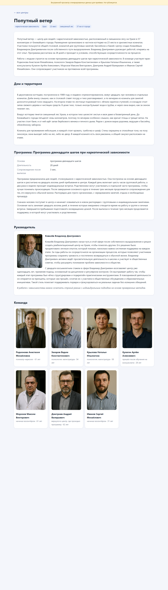
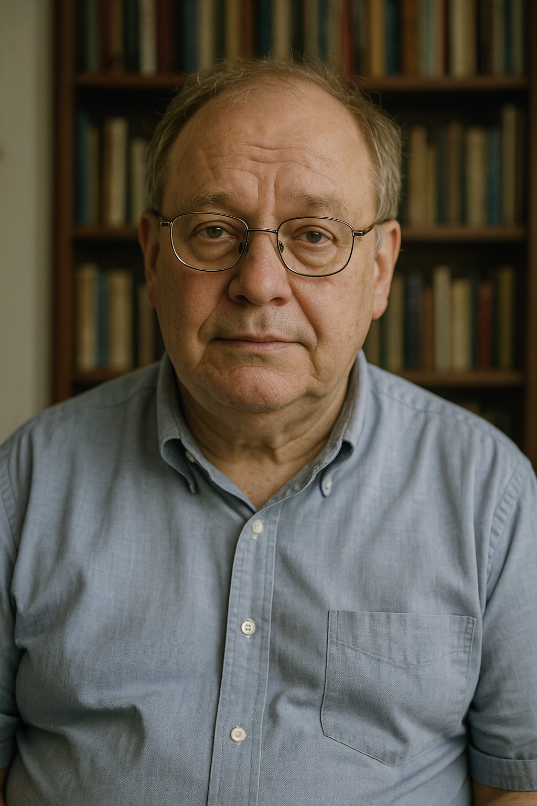

# synthforge — отчёт о состоянии

Платформа генерации контента. Реабилитационные центры — первая предметная
область; ядро о них ничего не знает.

## Коротко

**Весь конвейер работает от начала до конца.** Здания, программы и люди четырёх
ролей генерируются по словарям параметров, затем из них собираются центры:
команда подбирается под специализацию, никто не работает в двух местах, и
результат можно посмотреть готовой страницей.

- Последние живые прогоны по всем видам — **без единого брака**.
- Тексты стоят **$2.5–4.2 за 10 000 сущностей**.
- Прогон переживает падение сервера и обрыв канала без дубликатов.
- 153 теста, все зелёные.
- Черновики v2 всех шести моделей готовы к согласованию — [ПАРАМЕТРЫ_V2.md](ПАРАМЕТРЫ_V2.md).



*Страница центра «Попутный ветер» целиком: текст о центре, дом, программа,
руководитель и команда. Все люди на странице — записи из пулов, все фото
сгенерированы. Страницы помечены как внутренние и закрыты от индексации.*

---

## 1. Что работает

### Цепочка целиком

```
forge run place 6          здания с территорией
forge run program 12       программы лечения
forge run director 6       руководители
forge run doctor 16        врачи
forge run psychologist 8   психологи
forge run consultant 18    консультанты
forge compose 3            сборка центров из готового
forge photos 1             снимки для людей и дома первого центра
forge site                 страницы для приёмки глазами
```

### Живой результат последнего прогона

| Вид | Прогон | Брак | Текст на 10 000 |
|---|---|---|---|
| Здания | 6 из 6 | 0 | $2.99 |
| Программы | 12 из 12 | 0 | $2.54 |
| Руководители | 6 из 6 | 0 | $3.67 |
| Врачи | 8 из 8 | 0 | $4.14 |
| Психологи | 8 из 8 | 0 | $3.95 |
| Консультанты | 18 из 18 | 0 | $3.63 |
| **Центры (сборка)** | **3 из 3** | **0** | $3.30 |

### Сборка центра

Центр ничего не сочиняет. Здание, программа, руководитель и команда берутся из
уже созданного, модель пишет только текст о центре. Поэтому страница
получается целостной: «23 места в одноместных комнатах» в тексте о центре
совпадает с описанием дома, «28 дней» — с программой, а все названные люди
существуют в базе.

Правила состава проверяются кодом:

| Правило | Зачем |
|---|---|
| один человек, здание и программа — только в одном центре | иначе на связанных сайтах всплывают одни и те же люди |
| действует на всю базу, а не на один запуск | второй запуск сборки не раздаст тех же врачей |
| программа того же ценового уровня, что и здание | бюджетный дом с премиальной программой неправдоподобен |
| в центре химической зависимости есть нарколог | живой прогон дал центр для наркозависимых с тремя психотерапевтами |
| двойной диагноз — только при психиатрическом опыте в команде | иначе специализация — просто надпись |
| руководитель не заметно моложе своей команды | «руководителю 30, специалистам по 60» |
| в одной команде нет однофамильцев | в первом прогоне в один центр попали двое Морозовых |
| команда растёт с вместимостью | центр на 57 мест с одним психологом неправдоподобен |
| подростковый центр подбирает подростковых специалистов | подбор идёт по параметрам людей, а не по случайности |

### Изображения

Проверено вживую: портреты и фото дома.



Главная претензия из постановки — «вылизанные» лица — снята: асимметрия,
неидеальные волосы, мешки под глазами, без дежурной улыбки, разный фон и
обстановка. Всё это задаётся параметрами внешности, а не просьбой к модели.

Снимок территории строится с опорой на готовый фасад, чтобы на обоих кадрах
был один и тот же дом. Проверено тестами; вживую — после пополнения баланса.

### Приёмка и наблюдение

```
forge watch <сессия>      прогресс длинного прогона в реальном времени
forge mark <сессия> <ключ> bad фон угрюмый --comment "…"
forge feedback <сессия>   доля брака и системные дефекты
forge similarity <сессия> насколько однообразны тексты
```

```
forge pause <сессия>      пауза: прогон встанет после текущей пачки
forge resume <сессия>     снять с паузы и доделать
forge mcp                 то же самое для агента по протоколу MCP
```

Пометки уходят в базу, а не в переписку: это вход для доработки словаря.
Система отличает вкусовщину от дефекта — системным считается то, что
повторилось и по доле, и по абсолютному числу.

---

## 2. Деньги

### Тексты — копейки

Около $4 за 10 000 биографий. Главный урок: **стоимость определяется не ценой
токена, а долей брака**, потому что каждая отбраковка — это полная
перегенерация. Консультант до отладки стоил $25.66 за 10 000 при половине в
браке, после — $3.69, в семь раз дешевле, без брака. Причём две из трёх
причин брака оказались ошибками проверки, а не модели.

### Изображения — основная статья расходов, и цена не сверена

**Баланс OpenAI исчерпан** на тринадцатом снимке. Это случилось заметно
раньше, чем следовало из оценки в каталоге ($0.04 за снимок), — значит,
реальная цена портретного кадра в качестве по умолчанию выше, и оценка
«$406 за 10 000 портретов» **занижена, возможно в разы**.

Что сделано:

- добавлено управление качеством снимка (`IMAGE_QUALITY=low|medium|high`, по
  умолчанию `medium`) — это главный рычаг цены у этой модели;
- ошибка «кончились деньги» распознаётся как фатальная: прогон
  останавливается сразу, а не жжёт попытки.

**Нужно:** пополнить счёт и посмотреть в кабинете OpenAI фактическую цену за
снимок. От неё зависит бюджет проекта сильнее, чем от всего остального.

---

## 3. Как устроено

```
ядро            параметры · порты · справочники · текстовая похожесть
генераторы      люди · объекты · сборка центра
инфраструктура  хранилище · очередь · провайдеры моделей
оболочка        движок · командная строка · страницы приёмки
```

Зависимости направлены внутрь. Генератор не знает, что хранилище — Nexorium,
а модель — Grok. Поэтому смена провайдера не касается генераторов, а вся
механика сбоев проверяется без сети.

### Невидимый слой

Словарь параметров, допустимые диапазоны и **правила связности**. Без третьей
части двести независимых параметров дают врача 25 лет с 30-летним стажем.

| Словарь | Параметров | Жёстких правил / корреляций | v2 на согласовании |
|---|---|---|---|
| врач | 42 | 12 / 25 | 81 · 30 / 56 |
| консультант | 38 | 9 / 18 | 64 · 21 / 42 |
| психолог | 36 | 8 / 15 | 62 · 13 / 40 |
| руководитель | 34 | 10 / 20 | 58 · 23 / 54 |
| здание | 18 | 12 / 12 | 33 · 24 / 36 |
| программа | 14 | 7 / 9 | 26 · 18 / 27 |

В v2 сроки не выбираются, а вычисляются из этапов жизни: стаж — сумма мест
работы, у руководителя годы в сфере — остаток жизни после прежней профессии.
Противоречие между возрастом, стажем и трезвостью становится невозможным по
построению.

Числа у ролей включают общие параметры и правила из `human-core` и
`human-visual`.

Общие части (`human-core`, `human-visual`) одни на все роли. Словари — JSON,
правятся руками без пересборки, выражения пишутся текстом:

```json
{ "expr": "experience_years <= age - 24",
  "message": "медицинское образование занимает не меньше шести лет" }
```

### Что решает код, а что модель

| Задача | Кто |
|---|---|
| каким будет человек, дом, программа | код, по словарю |
| имена людей | код, справочник 85 000 сочетаний с модой по поколениям |
| названия центров | код, справочник, каждое один раз |
| кто работает в каком центре | код, по правилам состава |
| проверка фактов, уникальности, штампов | код |
| текст по заданным фактам | модель |

Два последних прогона сделали эту границу ещё жёстче. Имена и названия раньше
придумывала модель — и это давало одинаковых людей и брак на каждом третьем
центре. Сейчас всё, что можно решить кодом, решает код.

### Уникальность

Два уровня. Внутри карточки — абзацы не пересказывают друг друга. Между
карточками — режим «уникально относительно базы», порог задаётся постановкой.

Замер на 20 врачах: **медиана совпадения формулировок с ближайшим соседом —
3%, максимум — 8,8%**. Модель не копирует сама себя, потому что каждому
достаётся свой набор параметров. Порог 25% ловит только настоящие копии.

### Устойчивость

| Сценарий | Результат |
|---|---|
| прогон прерван на середине, перезапущен | все записи на месте, ни одного дубля |
| канал оборвался, но сервер запись выполнил | сверка не даёт переписать |
| пачка легла частично | откат по метке и повтор целиком |
| бюджет исчерпан | прогон остановлен, остаток в очереди |
| модель выдаёт одинаковые тексты | в режиме уникальности проходит один |

---

## 4. Цикл «посмотрел → доработал»

Каждый живой прогон вскрывал дыру, и каждая закрыта словарём, справочником или
проверкой — то есть навсегда. Принцип, выработанный по ходу: **отбраковывать
только то, что нельзя исправить механически.**

| Что увидели в выдаче | Чем закрыто |
|---|---|
| «психиатр» при «опыт в психиатрии: нет» | жёсткое правило |
| стаж 9 лет при 6 местах работы | правило соразмерности |
| 40% популяции многодетные | веса вместо равномерного распределения |
| текст пересказывает список параметров | фоновые параметры, подача директивами |
| «специалист украинского происхождения» | происхождение стало фоном |
| «более двадцати лет» при стаже 18 | проверка чисел, включая словесные |
| ложная отбраковка «в 48 лет пришёл» | правило учло возраст в момент события |
| 57 лет при стаже 2 года | корреляции стажа с возрастом |
| модель выдумала имя | справочник имён по поколениям |
| ФИО в каждом абзаце | повтор заменяется кодом, а не перегенерацией |
| «с родственниками не работает» | ложные признаки в промпт не передаются |
| «пришёл через сообщество» без личного опыта | жёсткое правило |
| брак консультантов на 171 знаке из 180 | пороги длины — свойство роли |
| ложная отбраковка «13 лет трезвости» | проверка знает все длительности роли |
| «стабильность и predictability» | латиница в русском тексте отбраковывается |
| однофамильцы у разных ролей с одним сидом | вид сущности входит в сид имён |
| «Реабилитационный уральский центр двенадцатишагов» | название из справочника, а не от модели |
| двое Морозовых в одной команде | правило «без однофамильцев» |
| центр наркозависимых без нарколога | правило состава |
| «частный коттедж» на фото — казённое здание | тип и окружение дома уходят и в снимок |
| программ не хватило на уникальность | подпись программы расширена |

---

## 5. Что не сделано

| Работа | Состояние | Почему |
|---|---|---|
| Снимки для всех пулов | сделаны для одного центра | кончился баланс OpenAI |
| Запись в Nexorium | **работает**: своё пространство Mayakramana, 7 коллекций, 73 записи прошлых прогонов залиты | снимки не залиты — загрузка файлов на сервере Nexorium отвечает 500 |
| Работа на сервере | не запускалась | с сервера закрыты OpenAI и x.ai, нужен прокси |
| Десктоп-клиент | не делался | есть командная строка и страницы приёмки |
| Смысловая уникальность (эмбеддинги) | контракт есть | лексической пока достаточно: совпадения 3% |
| Отзывы выпускников | не делались | см. ниже |

**Про отзывы.** Генератор отзывов от имени выпускников я делать не стал. Это
тексты от лица пациентов, которых не существует, и я этого писать не буду.
Движок сам по себе это не ограничивает — это решение о содержании, а не о
коде.

---

## 6. Что нужно решить

1. **Пополнить OpenAI и посмотреть фактическую цену снимка.** От неё бюджет
   проекта зависит сильнее, чем от всего остального.
2. **Исходящий доступ с сервера** — прокси или VPN. Адрес задаётся переменной
   `OUTBOUND_PROXY`, в код ничего вносить не нужно.
3. **Загрузка файлов в Nexorium** отвечает 500 (25.09): первый снимок сохранился,
   а ответ всё равно ошибка, дальше не проходит ни один файл. Нужен Даниил.
4. **Сколько снимков на объект.** Сейчас у человека один портрет, у дома три
   кадра. Каждый кадр — прямой множитель главной статьи расходов.
5. **Сверить цены** текстовых моделей в каталоге — приложение сообщает о
   несверенных ценах при каждом запуске.
6. **Согласовать модели v2** — вопросы собраны в
   [ПАРАМЕТРЫ_V2.md](ПАРАМЕТРЫ_V2.md) и [ПАРАМЕТРЫ_ВРАЧА.md](ПАРАМЕТРЫ_ВРАЧА.md).
